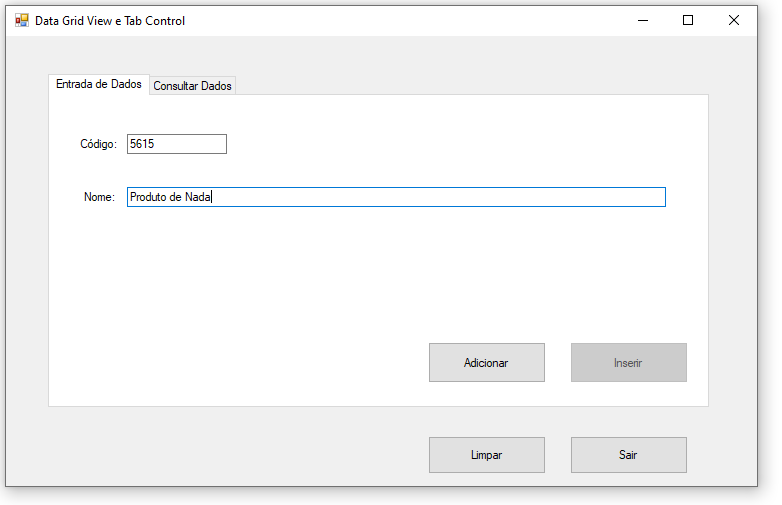
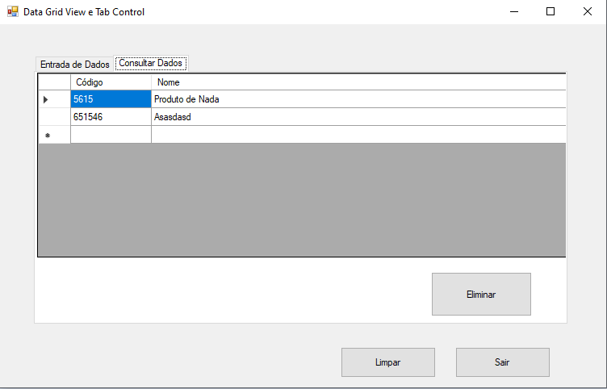
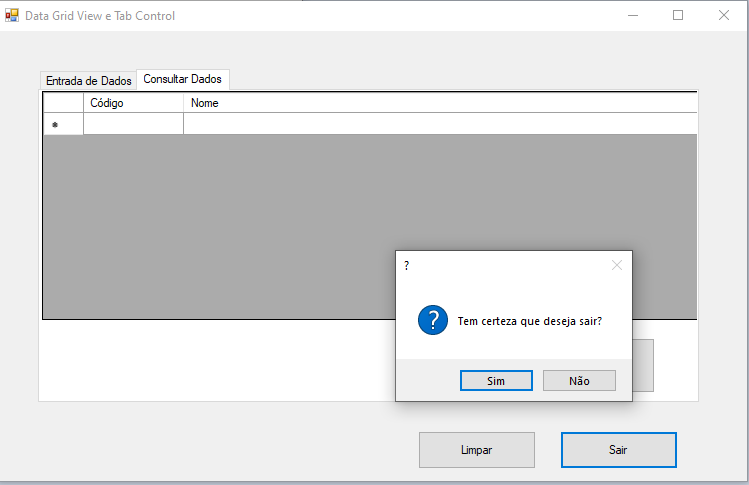

# aulaDataGridViewETabControl-CSharp
aula para aprender DataGridView e TabControl. Aula de DS na Etec de Guarulhos com a professora Marlene.
  

  <h3>A página inicial que você coloca informações e insere elas na lista</h3>
  

  

  <h3>As informações vão pra esse lugar</h3>
  

  

  <h3>Dá pra deletar as informações e tem o botão de sair</h3>
  

